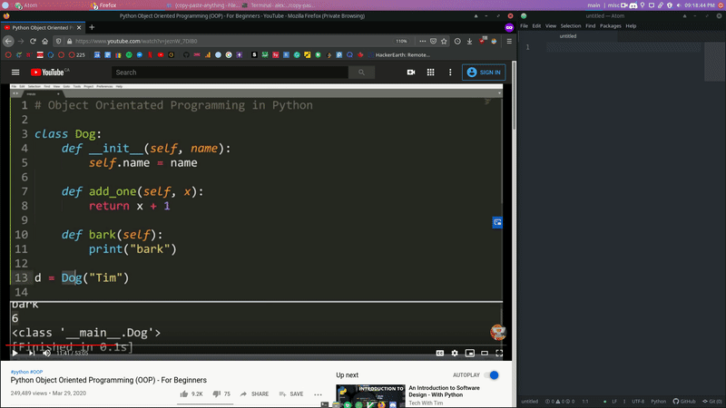

# Copy-Paste Anything

<p align="center">
    <a href="https://github.com/Alex0Blackwell/copy-paste-anything">
        
    </a>
</p>

<p align="center">
  <a href="#overview">Overview</a>
  &nbsp;&nbsp;&nbsp;|&nbsp;&nbsp;&nbsp;
  <a href="#examples">Examples</a>
  &nbsp;&nbsp;&nbsp;|&nbsp;&nbsp;&nbsp;
  <a href="#technologies">Technologies</a>
  &nbsp;&nbsp;&nbsp;|&nbsp;&nbsp;&nbsp;
  <a href="#developer-guide">Developer Guide</a>
</p>

## Overview
### Synopsis
Screen snip an area of your screen to have it converted to text and copied to your clipboard! This program allows you to copy text from anywhere on your screen. This means that text from videos, photos, or any filetype can be copied.

### Extended
Often, tutorials conta (non-breaking change win text that must be copied out line by line. This program, however, allows just a screen snip of an area to be taken, and the text in the area will automatically be converted to text and copied to your clipboard. In addition to its uses while watching videos, there exists literature that is stored in such a file type where it does not support the copy-pasting text. However, with this program, a screen snip of the area you wish to copy can be taken and the text will be copied to your clipboard. Any place you see text on your screen, this program can copy it so you can paste it!


## Examples

> Copy and paste from a code tutorial!



## Technologies
- **Python 3.8**
- **pytesseract 0.3**
  - Optical character recognition (OCR) tool
  - Reads the text embedded in images
- **PyAutoGUI 0.9**
  - Cross-platform GUI
- **tkinter 8.6**
  - Windowing toolkit for use with tlc
- **Pyperclip 1.8**
  - Cross-platform module for copy and paste clipboard functions


## Developer Guide
To contribute to this project, create a pull request against the
`main` branch. One of the owners of the project will review the
request and determine if it may be merged. See the
[CONTRIBUTING.md](.github/CONTRIBUTING.md) file for further reading.

### Environment Set Up
To run this project, install the dependencies and the requirements.  

### Dependencies
#### tesseract
If you are on a *windows* computer, you need to install the command line program [tesseract](https://github.com/tesseract-ocr/tesseract).  
There are builds available [here](https://github.com/UB-Mannheim/tesseract/wiki).
- Make sure this is installed to the default installation directory *(C:\Program Files\Tesseract-OCR)*.

#### tkinter
tkinter should come installed with Python, however, if it isn't you will have to install it.  
Install [tkinter](https://docs.python.org/3/library/tkinter.html "docs") for your operating system:  
**Debian:**

    sudo apt-get install python3-tk
**Fedora**

    sudo dnf install python3-tkinter
**Arch**

    sudo pacman -Syu tk
**etc...**  

#### pyperclip
- Windows
  - No additional modules needed.
- Mac
  - Needs `pbcopy` and `pbpaste` which should come with the OS.
- Linux
  - Needs `xclip` or `xsel` which should come with the OS.
  - Needs the `gtk` or `PyQt4` modules installed.

### Requirements
Install the requirements:  
```bash
make install
```

### Usage
Run the program:  
```bash
make run
```

Run the program and don't copy text to clipboard:
```bash
make run-no-copy
```

I would recommend making a keyboard shortcut for this program. For example, I made a keyboard shortcut for `ctrl-shift-prtSc`.  

## License
Licensed under the [GNU General Public License v3.0](LICENSE).
